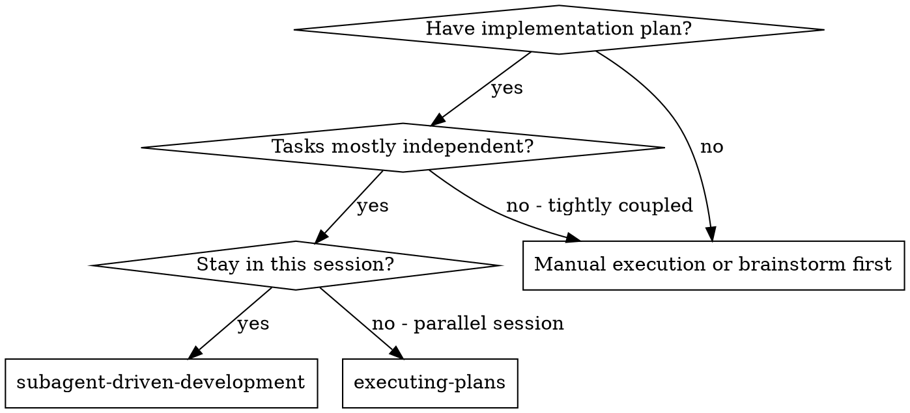
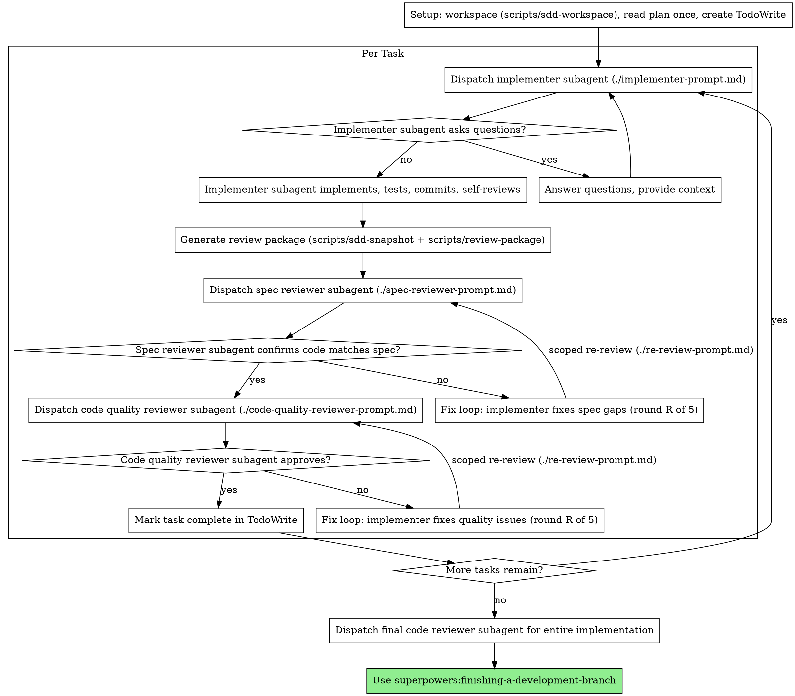

# Subagent-Driven Development

Execute plan by dispatching fresh subagent per task, with two-stage review after each: spec compliance review first, then code quality review.

**Why subagents:** You delegate tasks to specialized agents with isolated context. By precisely crafting their instructions and context, you ensure they stay focused and succeed at their task. They should never inherit your session's context or history — you construct exactly what they need. This also preserves your own context for coordination work.

**Core principle:** Fresh subagent per task + two-stage review (spec then quality) = high quality, fast iteration

**Artifacts travel as files.** Everything you paste into a dispatch prompt —
and everything a subagent prints back — stays resident in your context for
the rest of the session and is re-read on every later turn. Hand artifacts
over as paths: task briefs (`scripts/task-brief`), implementer reports
(report files in the plan workspace), review diffs
(`scripts/review-package`). Exact values (numbers, magic strings,
signatures) live in the brief — never retyped into the prompt.

## When to Use



**vs. Executing Plans (parallel session):**
- Same session (no context switch)
- Fresh subagent per task (no context pollution)
- Two-stage review after each task: spec compliance first, then code quality
- Faster iteration (no human-in-loop between tasks)

## The Process



## Model Selection

Use the least powerful model that can handle each role to conserve cost and increase speed.

**Mechanical implementation tasks** (isolated functions, clear specs, 1-2 files): use a fast, cheap model. Most implementation tasks are mechanical when the plan is well-specified.

**Integration and judgment tasks** (multi-file coordination, pattern matching, debugging): use a standard model.

**Architecture, design, and review tasks**: use the most capable available model.

**Task complexity signals:**
- Touches 1-2 files with a complete spec → cheap model
- Touches multiple files with integration concerns → standard model
- Requires design judgment or broad codebase understanding → most capable model

## Dispatching a Task

Record BASE before dispatching: `scripts/sdd-snapshot PLAN_FILE` prints a
tree SHA of the current working tree — no commit, no ref change, the real
index untouched. The review package and fix-round diffs need it.

- **Task brief:** run `scripts/task-brief PLAN_FILE N` — it extracts the
  task's full text to a file in the plan workspace and prints the path.
  The dispatch contains: (1) one line on where this task fits in the
  project; (2) the brief path, introduced as "read this first — it is your
  requirements, with the exact values to use verbatim"; (3) interfaces and
  decisions from earlier tasks the brief cannot know; (4) your resolution
  of any ambiguity you noticed in the brief; (5) the report-file path and
  report contract. Exact values (numbers, magic strings, signatures, test
  cases) appear only in the brief. Never make a subagent read the whole
  plan file.
- **Report file:** name it after the brief (`task-N-brief.md` →
  `task-N-report.md`) and put the path in the dispatch. The implementer
  writes the full report there and returns only status, a one-line
  summary, and concerns.
- A dispatch prompt describes one task, not the session's history. Do not
  paste accumulated prior-task summaries ("state after Tasks 1-3") into
  later dispatches — a real session's dispatch hit 42k chars of which 99%
  was pasted history. A fresh subagent needs its task, the interfaces it
  touches, and the global constraints. Nothing else.

## Reviewing a Task

When the implementer reports DONE: snapshot HEAD (`scripts/sdd-snapshot`)
and run `scripts/review-package PLAN_FILE BASE HEAD` — it writes the stat
summary and full diff (`-U10`) to a uniquely named file and prints the
path. BASE is the snapshot recorded before dispatching — never a bare
`git diff`, which sees every task's accumulated uncommitted changes at
once. The diff never enters your context; the reviewer sees it in one
Read call.

Reviewers get paths, not content: the brief, the report file, and the
review package — plus the global constraints that bind the task, copied
verbatim from the plan. Never dispatch a reviewer without a review-package
file.

Three dispatch rules keep reviews honest:

- **Do not pre-judge findings for the reviewer** — never instruct a
  reviewer to ignore or not flag a specific issue. If you believe a
  finding would be a false positive, let the reviewer raise it and
  adjudicate it in the fix loop. If the prompt you are writing contains
  "do not flag," "don't treat X as a defect," "at most Minor," or "the
  plan chose" — stop: you are pre-judging, usually to spare yourself a
  review loop.
- Do not add open-ended directives like "check all uses" or "run race
  tests if useful" without a concrete, task-specific reason.
- Do not ask a reviewer to re-run tests already run on the same code —
  the implementer's report (or your own verification run) carries the
  test evidence; the reviewer's job is code-level inspection.

## Handling Implementer Status

Implementer subagents report one of four statuses. Handle each appropriately:

**DONE:** Proceed to spec compliance review.

**DONE_WITH_CONCERNS:** The implementer completed the work but flagged doubts. Read the concerns before proceeding. If the concerns are about correctness or scope, address them before review. If they're observations (e.g., "this file is getting large"), note them and proceed to review.

**NEEDS_CONTEXT:** The implementer needs information that wasn't provided. Provide the missing context and re-dispatch.

**BLOCKED:** The implementer cannot complete the task. Assess the blocker:
1. If it's a context problem, provide more context and re-dispatch with the same model
2. If the task requires more reasoning, re-dispatch with a more capable model
3. If the task is too large, break it into smaller pieces
4. If the plan itself is wrong, escalate to the human

**Never** ignore an escalation or force the same model to retry without changes. If the implementer said it's stuck, something needs to change.

## The Fix Loop

The loop triggers when a review reports spec gaps or any Critical/Important
finding. Two kinds of findings leave it before it starts:

- **Minor findings never enter the loop.** Record each one as it appears
  (`Task <N>: minor (deferred): <one-liner>`) and hand the list to the final
  full-implementation review to triage what must be fixed before merge. A
  roll-up nobody reads is a silent discard.
- **A finding that conflicts with what the plan's text mandates is the
  human's decision.** Present the finding and the plan text side by side and
  ask which governs. Do not dismiss the finding because the plan mandates
  it, and do not dispatch a fix that contradicts the plan without asking.

Everything else enters the loop. A fix round is one fix dispatch plus one
scoped re-review. **Five rounds maximum per task.**

**Rounds 1-3 — resume the original implementer.** Send it the open findings
verbatim. Its context is intact: it knows the task, the code, and its own
choices. If your harness cannot send another message to a finished
subagent, dispatch a fresh implementer carrying the brief path, the
report-file path, and the findings — the report file is the persistent
memory either way.

**Rounds 4-5 — dispatch a fresh implementer on a more capable model**, with
the brief path, the report-file path, the open findings, and this framing:
"A prior implementer attempted this task [N] times; you own it now. Read
the report file for what was tried." A loop that survives three resumes
usually means the implementer cannot see its own problem — fresh eyes and
a capability bump in one move.

**Every round ends with a scoped re-review** — snapshot after the fix and
run `scripts/review-package PLAN_FILE FIX_BASE HEAD` (FIX_BASE = the
snapshot the previous review saw), then dispatch
[re-review-prompt.md](re-review-prompt.md) with the findings list, the
brief path, the report-file path, and the printed diff path. The
re-reviewer verdicts each finding ADDRESSED or NOT ADDRESSED ("attempted"
is not addressed) and inspects only what the fix touched for new breakage.
New Critical/Important breakage introduced by the fix joins the open
findings. Out-of-scope observations are recorded as deferred minors — they
never extend the loop. Never dispatch a fresh full review mid-loop.

**After each round,** record:
`Task <N>: fix round <R>/5 (<X> addressed, <Y> open — <finding one-liners>)`

Never fix findings yourself in the controller session — your context stays
clean for coordination, and controller fixes skip review.

**The breaker.** When round 5's re-review still leaves findings open, stop
dispatching. Adjudicate each open finding yourself — you hold the plan and
the cross-task context the reviewer lacks:

- **The reviewer is wrong, or the point is contestable:** park it —
  `Task <N>: parked — <finding> — ruling: <why the code stands>`. The final
  review sees both sides.
- **Real, but nothing downstream builds on it:** park it the same way, with
  a ruling that says it's real and deferred.
- **Real and load-bearing** — a later task builds on it, or it reveals a
  plan defect: STOP. Record `Task <N>: BLOCKED — <reason>` and report to
  the human with the finding, the plan text it collides with, and the fix
  history. Parking a structural failure lets every dependent task build on
  it and hands the final review a problem it cannot fix either.

Adjudicate only at the cap. Adjudicating earlier to end a loop is
pre-judging with a different name. Every adjudication is a recorded ruling —
a silent discard is forbidden.

| Excuse | Reality |
|--------|---------|
| "One more round will converge" | Past the cap, rounds don't converge — the failure is structural. Adjudicate and route. |
| "This finding is obviously wrong, I'll drop it" | You adjudicate only at the cap, and every ruling is recorded. Silent discards are forbidden. |
| "The fix was small, skip the re-review" | Unreviewed fixes are how regressions land. Every round ends with a scoped re-review. |
| "The reviewer will just find something new anyway" | Scoped re-reviews verify fixes; they cannot wander. New findings on untouched code are deferred, not looped. |

## Prompt Templates

- `./implementer-prompt.md` - Dispatch implementer subagent
- `./spec-reviewer-prompt.md` - Dispatch spec compliance reviewer subagent
- `./code-quality-reviewer-prompt.md` - Dispatch code quality reviewer subagent
- `./re-review-prompt.md` - Dispatch scoped re-review after a fix round

## Scripts

- `./scripts/sdd-workspace PLAN_FILE` - Print this plan's artifact directory
  (`.gor-mobile/state/<plan-basename>/`), creating it if needed
- `./scripts/task-brief PLAN_FILE N` - Extract Task N's full text into a
  brief file, print the path
- `./scripts/sdd-snapshot PLAN_FILE` - Snapshot the working tree as a git
  tree object (no commit, no ref change), print the tree SHA
- `./scripts/review-package PLAN_FILE BASE HEAD` - Write stat + full diff
  between two snapshots (or any tree-ish) to a file, print the path

## Example Workflow

```
You: I'm using Subagent-Driven Development to execute this plan.

[Resolve workspace: scripts/sdd-workspace docs/plans/feature-plan.md]
[Read plan file once, note context and constraints]
[Create TodoWrite with all tasks]

Task 1: Hook installation script

[Record BASE: scripts/sdd-snapshot; run scripts/task-brief for Task 1]
[Dispatch implementer with brief + report paths + one line of context]

Implementer: "Before I begin - should the hook be installed at user or system level?"

You: "User level (~/.config/superpowers/hooks/)"

Implementer: "Got it. Implementing now..."
[Later] Implementer:
  - Implemented install-hook command
  - Added tests, 5/5 passing
  - Self-review: Found I missed --force flag, added it
  - Committed

[Snapshot HEAD; run scripts/review-package; dispatch spec reviewer with
 brief + report + package paths]
Spec reviewer: ✅ Spec compliant - all requirements met, nothing extra

[Dispatch code quality reviewer with the same package]
Code reviewer: Strengths: Good test coverage, clean. Issues: None. Approved.

[Mark Task 1 complete]

Task 2: Recovery modes

[Record BASE: scripts/sdd-snapshot; run scripts/task-brief for Task 2]
[Dispatch implementer with brief + report paths]

Implementer: [No questions, proceeds]
Implementer:
  - Added verify/repair modes
  - 8/8 tests passing
  - Self-review: All good
  - Committed

[Snapshot HEAD; run scripts/review-package; dispatch spec reviewer]
Spec reviewer: ❌ Issues:
  - Missing: Progress reporting (spec says "report every 100 items")
  - Extra: Added --json flag (not requested)

[Fix round 1/5: resume implementer with both findings]
Implementer: Removed --json flag, added progress reporting

[Snapshot; run scripts/review-package over the fix range]
[Dispatch scoped re-review (./re-review-prompt.md)]
Re-reviewer: Missing progress reporting — ADDRESSED (src/recovery.js:41).
  Extra --json flag — ADDRESSED (removed). New breakage: none.
  Verdict: all findings addressed.

[Dispatch code quality reviewer]
Code reviewer: Strengths: Solid. Issues (Important): Magic number (100)

[Fix round 1/5: resume implementer]
Implementer: Extracted PROGRESS_INTERVAL constant

[Snapshot; run scripts/review-package over the fix range]
[Dispatch scoped re-review (./re-review-prompt.md)]
Re-reviewer: Magic number — ADDRESSED (src/recovery.js:7). Verdict: all
  findings addressed.

[Mark Task 2 complete]

...

[After all tasks]
[Dispatch final code-reviewer]
Final reviewer: All requirements met, ready to merge

Done!
```

## Advantages

**vs. Manual execution:**
- Fresh context per task (no confusion)
- Parallel-safe (subagents don't interfere)
- Subagent can ask questions (before AND during work)

**vs. Executing Plans:**
- Same session (no handoff)
- Continuous progress (no waiting)
- Review checkpoints automatic

**Efficiency gains:**
- Briefs, reports, and review diffs travel as file paths — the controller's
  context stays lean across the whole plan
- Controller curates exactly what context is needed
- Subagent gets complete information upfront (one Read call per artifact)
- Questions surfaced before work begins (not after)

**Quality gates:**
- Self-review catches issues before handoff
- Two-stage review: spec compliance, then code quality
- Review loops ensure fixes actually work
- Spec compliance prevents over/under-building
- Code quality ensures implementation is well-built

**Cost:**
- More subagent invocations (implementer + 2 reviewers per task)
- Controller does more prep work (extracting all tasks upfront)
- Review loops add iterations
- But catches issues early (cheaper than debugging later)

## Red Flags

**Never:**
- Start implementation on main/master branch without explicit user consent
- Skip reviews (spec compliance OR code quality)
- Proceed with unfixed issues
- Dispatch multiple implementation subagents in parallel (conflicts)
- Make a subagent read the whole plan file (run scripts/task-brief; hand it
  the brief path)
- Paste task text, reports, or diffs into prompts (artifacts travel as
  file paths — pasted content stays resident in your context all session)
- Dispatch a reviewer without a review-package file
- Skip scene-setting context (subagent needs to understand where task fits)
- Ignore subagent questions (answer before letting them proceed)
- Accept "close enough" on spec compliance (spec reviewer found issues = not done)
- Skip review loops (reviewer found issues = fix round + scoped re-review)
- Let implementer self-review replace actual review (both are needed)
- **Start code quality review before spec compliance is ✅** (wrong order)
- Move to next task while either review has open issues

**If subagent asks questions:**
- Answer clearly and completely
- Provide additional context if needed
- Don't rush them into implementation

**If reviewer finds issues:**
- Enter The Fix Loop (above): fix round + scoped re-review, five rounds max
- Rounds 1-3 resume the implementer; rounds 4-5 fresh implementer, tier up
- At the cap the breaker adjudicates: park with ruling or BLOCKED to human
- Never loop past the cap, never adjudicate before it, never skip the
  scoped re-review

**If subagent fails task:**
- Dispatch fix subagent with specific instructions
- Don't try to fix manually (context pollution)

## Integration

**Required workflow skills:**
- **superpowers:using-git-worktrees** - REQUIRED: Set up isolated workspace before starting
- **superpowers:writing-plans** - Creates the plan this skill executes
- **superpowers:requesting-code-review** - Code review template for reviewer subagents
- **superpowers:finishing-a-development-branch** - Complete development after all tasks

**Alternative workflow:**
- **superpowers:executing-plans** - Use for parallel session instead of same-session execution
